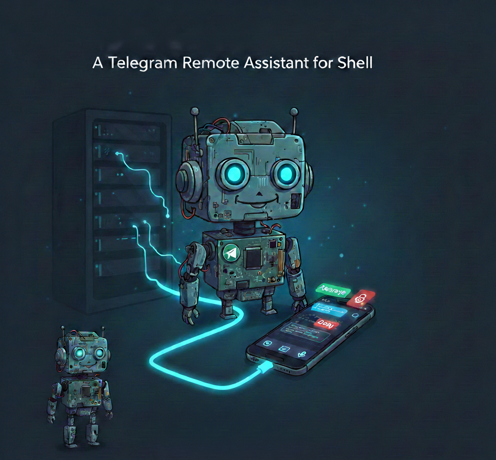

<p align="center">
  
</p>

<h1 align="center">Trash bot</h1>

A Telegram Remote Assistant for SHell is a telegram bot that gives you direct access to [Claude Code](https://docs.anthropic.com/en/docs/claude-code) from your phone. Send messages, photos, or voice notes — Claude responds and can execute shell commands with your approval.

This bot is an evolution of previously published bots:
- https://github.com/fnzv/trsh-go
- https://github.com/fnzv/trsh


<p align="center">
  <a href="https://github.com/fnzv/trash/actions/workflows/ci.yml?branch=main"></a>
  <a href="https://github.com/fnzv/trash/releases"></a>
  <a href="LICENSE"></a>
</p>

> ⚠️ This bot has been coded with Claude Code itself, do not paste anything dangerous or non-sanitized data into it if you do not know what you are doing ⚠️

## Features

- **Chat with Claude** from Telegram — text, photos, and voice messages
- **Command approval workflow** — Claude proposes shell commands, you tap Approve or Deny
- **Session memory** — conversations persist across messages (`/new` to reset)
- **OAuth login** — authenticate Claude CLI directly through Telegram (`/login`)
- **Built-in safeguards** — blocks dangerous commands (rm -rf /, reverse shells, container escapes, etc.)
- **Voice transcription** — voice messages are transcribed via Whisper and sent to Claude
- **Chat ID whitelist** — only authorized users can interact with the bot
- **Interationg with Gitlab** — direct interaction with a code base in Gitlab (e.g. giving a readonly token and ssh key for pushing)

## How It Works

```
You (Telegram) --> Trash Bot --> Claude Code CLI --> Response
                                     |
                              Needs to run a command?
                                     |
                              Approve / Deny buttons
                                     |
                              Executes & feeds output
                              back to Claude
```

## Quick Start

### Prerequisites

- Go 1.23+
- [Claude Code CLI](https://docs.anthropic.com/en/docs/claude-code) installed and authenticated
- A Telegram bot token from [@BotFather](https://t.me/BotFather)
- Your Telegram chat ID (use [@userinfobot](https://t.me/userinfobot) to find it)

### Run Locally

```bash
# Clone and build
git clone https://github.com/youruser/trash-bot.git
cd trash-bot
go build -o trash-bot .

# Configure
cp .env.example .env
# Edit .env with your token and chat ID

# Run
export $(cat .env | xargs)
./trash-bot
```

### Run with Docker

```bash
docker build -t trash-bot .
docker run --env-file .env trash-bot
```

## Configuration

All configuration is done via environment variables. Create a `.env` file from the example:

```bash
cp .env.example .env
```

| Variable | Required | Default | Description |
|----------|----------|---------|-------------|
| `TELEGRAM_BOT_TOKEN` | Yes | — | Bot token from [@BotFather](https://t.me/BotFather) |
| `ALLOWED_CHAT_IDS` | Yes | — | Comma-separated Telegram chat IDs allowed to use the bot |
| `WORK_DIR` | No | `.` | Working directory for command execution |
| `CLAUDE_PATH` | No | `claude` | Path to the Claude Code CLI binary |
| `COMMAND_TIMEOUT` | No | `5m` | Max duration for command execution (Go duration format) |
| `ALLOWED_TOOLS` | No | — | Claude Code tool whitelist (e.g. `Bash(docker *),Read(*)`) |
| `SKIP_PERMISSIONS` | No | `false` | Set to `true` to auto-execute commands without approval buttons |
| `SYSTEM_PROMPT` | No | — | Custom system prompt prepended to Claude conversations |
| `MAX_TOOL_ROUNDS` | No | `20` | Max command execution rounds per message |
| `GIT_SSH_KEY` | No | — | Base64-encoded SSH key for git operations |
| `GIT_USER_NAME` | No | — | Git author name |
| `GIT_USER_EMAIL` | No | — | Git author email |
| `GITLAB_TOKEN` | No | — | GitLab API token for repo access |

## Telegram Commands

| Command | Description |
|---------|-------------|
| `/start` | Welcome message |
| `/new` | Start a fresh conversation (clears session) |
| `/login` | Authenticate Claude CLI via OAuth (sends you the login URL) |
| `/help` | Show available commands |

## Security

The bot includes a safeguard system that blocks dangerous commands before execution:

- **Destructive filesystem ops** — `rm -rf /`, `mkfs`, `dd` to block devices
- **Container escapes** — `nsenter`, docker socket access, `/proc/1/root`, cgroup manipulation
- **Reverse shells** — bash `/dev/tcp`, netcat `-e`, socat, python/perl socket shells
- **Privilege escalation** — writing to `/etc/passwd`, `/etc/shadow`, `/etc/sudoers`
- **Data exfiltration** — curling secret env vars, exfiltrating credential files
- **Pipe to shell** — `curl | sh` patterns

These safeguards run even when `SKIP_PERMISSIONS=true`. See `safeguard.go` for the full rule set.

> **Warning:** This bot executes shell commands on the host machine. Always run it in a container or sandboxed environment. Never expose it to untrusted users.

## Project Structure

```
main.go        Entry point, config loading, graceful shutdown
bot.go         Telegram update loop, dispatches messages & callbacks
handlers.go    Routes commands, calls Claude, manages approval flow
claude.go      Wraps Claude CLI as a subprocess, parses tool-use blocks
sender.go      Sends Telegram messages, handles the 4096-char limit
markdown.go    Converts Markdown to Telegram MarkdownV2 format
approval.go    In-memory state for pending approvals and login flows
config.go      Loads environment variables into config struct
safeguard.go   Security rules that block dangerous commands
media.go       Handles photos and voice messages (Whisper transcription)
git.go         Sets up git config and SSH keys inside the container
```

## Deployment

A `Dockerfile` and Terraform config (`trash-bot.tf`) are included for deploying to Kubernetes. The Docker image bundles Claude Code CLI, Python (for Whisper), and the bot binary.

```bash
# Build and push
docker build -t your-registry/trash-bot:latest .
docker push your-registry/trash-bot:latest
```

## License

MIT
