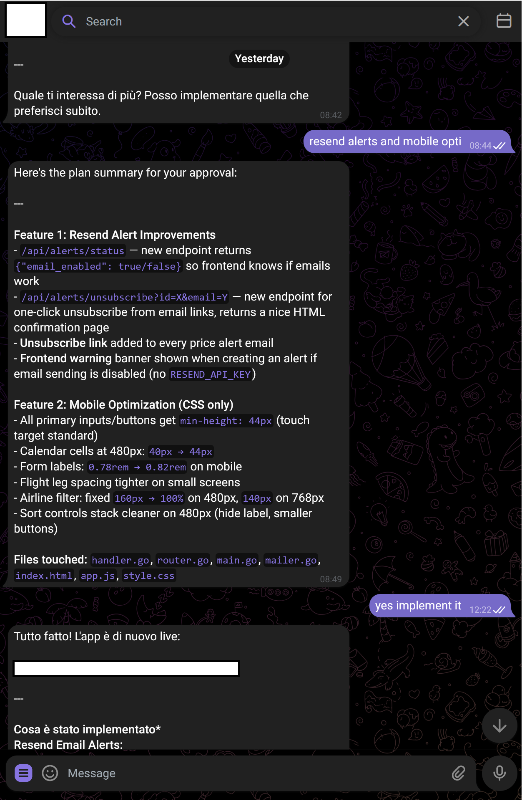

<p align="center">
  
</p>
<h1 align="center">Trash bot</h1>

A **T**elegram **R**emote **A**ssistant for **SH**ell — a Telegram bot that gives you direct access to [Claude Code](https://docs.anthropic.com/en/docs/claude-code) or [Gemini CLI](https://github.com/google-gemini/gemini-cli) from your phone. Send messages, photos, or voice notes — the AI responds and can execute shell commands with your approval.

This bot is an evolution of previously published bots:
- https://github.com/fnzv/trsh-go
- https://github.com/fnzv/trsh


<p align="center">
  <a href="https://github.com/fnzv/trash/actions/workflows/docker-build.yml">
    
  </a>
  <a href="https://github.com/fnzv/trash/releases">
    
  </a>
  <a href="LICENSE">
    
  </a>
</p>


> ⚠️ This bot has been coded with Claude Code itself, do not paste anything dangerous or non-sanitized data into it if you do not know what you are doing ⚠️

## Features

- **Chat with Claude or Gemini** from Telegram — switch providers with `/claude` and `/gemini`
- **Command approval workflow** — the AI proposes shell commands, you tap Approve or Deny
- **Session memory** — conversations persist across messages (`/new` to reset)
- **OAuth / API key login** — authenticate directly through Telegram (`/login` works for both providers)
- **Built-in safeguards** — blocks dangerous commands (rm -rf /, reverse shells, container escapes, etc.)
- **Voice transcription** — voice messages are transcribed via Whisper
- **Chat ID whitelist** — only authorized users can interact with the bot
- **GitLab integration** — direct interaction with a code base (readonly token + SSH key for pushing)

## How It Works

```
You (Telegram) --> Trash Bot --> Active AI (Claude or Gemini) --> Response
                                         |
                                  Needs to run a command?
                                         |
                                  Approve / Deny buttons
                                         |
                                  Executes & feeds output
                                  back to the AI
```

You can switch AI providers per-chat at any time without restarting the bot:

```
/claude   → Claude Code CLI (default)
/gemini   → Gemini CLI (gemini-2.5-pro by default)
/model    → show which AI is currently active
```

## Screenshot

The following is a sample interaction with the bot running as a pod, once provided the tools you can build "remotely" or plan ideas

<p align="center">
  
</p>

## Quick Start

### Prerequisites

- Go 1.23+
- [Claude Code CLI](https://docs.anthropic.com/en/docs/claude-code) and/or [Gemini CLI](https://github.com/google-gemini/gemini-cli) installed
- A Telegram bot token from [@BotFather](https://t.me/BotFather)
- Your Telegram chat ID (use [@userinfobot](https://t.me/userinfobot) to find it)

### Run Locally

```bash
# Clone and build
git clone https://github.com/fnzv/trash.git
cd trash
go build -o trash-bot .

# Configure
cp .env.example .env
# Edit .env with your token and chat ID

# Run
export $(cat .env | xargs)
./trash-bot
```

### Run with Docker

```bash
# Build your own image
docker build -t trash-bot .
docker run --env-file .env trash-bot

# Run with the already built image
docker run --env-file .env fnzv/trash:latest
```

## Configuration

All configuration is done via environment variables. Create a `.env` file from the example:

```bash
cp .env.example .env
```

| Variable | Required | Default | Description |
|----------|----------|---------|-------------|
| `TELEGRAM_BOT_TOKEN` | Yes | — | Bot token from [@BotFather](https://t.me/BotFather) |
| `ALLOWED_CHAT_IDS` | Yes | — | Comma-separated Telegram chat IDs allowed to use the bot |
| `WORK_DIR` | No | `.` | Working directory for command execution |
| `CLAUDE_PATH` | No | `claude` | Path to the Claude Code CLI binary |
| `GEMINI_PATH` | No | `gemini` | Path to the Gemini CLI binary |
| `GEMINI_MODEL` | No | `gemini-2.5-pro` | Gemini model to use (e.g. `gemini-2.0-flash`) |
| `GEMINI_API_KEY` | No | — | Gemini API key — can also be set via `/login` in Telegram |
| `DEFAULT_PROVIDER` | No | `claude` | Default AI provider: `claude` or `gemini` |
| `COMMAND_TIMEOUT` | No | `5m` | Max duration for command execution (Go duration format) |
| `ALLOWED_TOOLS` | No | — | Claude Code tool whitelist (e.g. `Bash(docker *),Read(*)`) |
| `SKIP_PERMISSIONS` | No | `false` | Set to `true` to auto-execute commands without approval buttons |
| `SYSTEM_PROMPT` | No | — | Custom system prompt prepended to all conversations |
| `MAX_TOOL_ROUNDS` | No | `20` | Max command execution rounds per message |
| `GIT_SSH_KEY` | No | — | Base64-encoded SSH key for git operations |
| `GIT_USER_NAME` | No | — | Git author name |
| `GIT_USER_EMAIL` | No | — | Git author email |
| `GITLAB_TOKEN` | No | — | GitLab API token for repo access |
| `NGROK_AUTHTOKEN` | No | — | Ngrok auth token to expose locally developed applications |

## Telegram Commands

| Command | Description |
|---------|-------------|
| `/start` | Welcome message |
| `/new` | Start a fresh conversation (clears session for both providers) |
| `/claude` | Switch active AI to Claude |
| `/gemini` | Switch active AI to Gemini |
| `/model` | Show currently active AI provider |
| `/login` | Authenticate the active AI — Claude: OAuth URL flow; Gemini: paste API key from [aistudio.google.com/apikey](https://aistudio.google.com/apikey) |
| `/usage` | Show token/cost usage for the current session (Claude only) |
| `/safeguard <cmd>` | Test a command against safeguard rules without executing it |
| `/help` | Show available commands |

## Authentication

### Claude
Authentication is handled entirely through Telegram via `/login`:
1. The bot starts an OAuth flow and sends you a URL
2. You authenticate in your browser and receive an auth code
3. Paste the code back into the chat — done

### Gemini
Gemini CLI uses a Google API key. You can set it in two ways:
- **Via Telegram (recommended for remote setup):** Switch to Gemini (`/gemini`), then `/login`. The bot sends you the [Google AI Studio](https://aistudio.google.com/apikey) link. Create an API key and paste it back. It's saved to disk and persists across restarts.
- **Via environment variable:** Set `GEMINI_API_KEY=AIza...` in your `.env` before starting.

## Security

The bot includes a safeguard system that blocks dangerous commands before execution:

- **Destructive filesystem ops** — `rm -rf /`, `mkfs`, `dd` to block devices
- **Container escapes** — `nsenter`, docker socket access, `/proc/1/root`, cgroup manipulation
- **Reverse shells** — bash `/dev/tcp`, netcat `-e`, socat, python/perl socket shells
- **Privilege escalation** — writing to `/etc/passwd`, `/etc/shadow`, `/etc/sudoers`
- **Data exfiltration** — curling secret env vars, exfiltrating credential files
- **Pipe to shell** — `curl | sh` patterns

These safeguards run even when `SKIP_PERMISSIONS=true`. See `safeguard.go` for the full rule set.

> **Warning:** This bot executes shell commands on the host machine. Always run it in a container or sandboxed environment. Never expose it to untrusted users or share sensitive data as it's piped to the model

## Project Structure

```
main.go        Entry point, config loading, graceful shutdown
bot.go         Telegram update loop, dispatches messages & callbacks
handlers.go    Routes commands, calls AI, manages approval and login flows
claude.go      Wraps Claude CLI as a subprocess, parses tool-use blocks
gemini.go      Wraps Gemini CLI, manages in-process conversation history & API key
sender.go      Sends Telegram messages, handles the 4096-char limit
markdown.go    Converts Markdown to Telegram MarkdownV2 format
approval.go    In-memory state for pending approvals and login flows
config.go      Loads environment variables into config struct
safeguard.go   Security rules that block dangerous commands
media.go       Handles photos and voice messages (Whisper transcription)
git.go         Sets up git config and SSH keys inside the container
```

## Deployment

A `Dockerfile` and Terraform config (`trash-bot.tf`) are included for deploying to Kubernetes. The Docker image bundles Claude Code CLI, Gemini CLI, Python (for Whisper), and the bot binary.

```bash
# Build and push
docker build -t your-registry/trash-bot:latest .
docker push your-registry/trash-bot:latest
```

## License

MIT
